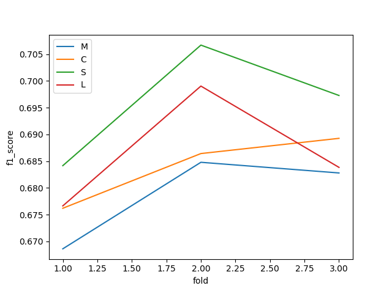

## Task – Identificarea dialectului Român:
Antrenarea unui model pe pasaje preluate de pe twitter pentru a clasifica orice text după dialect, român sau moldovenesc. Set de antrenare: 7757 de sample-uri. Set de validare: 2656 de sample-uri. Toate sample-ruile sunt preprocesate pentru a înlocui entitățile cu nume cu o etichetă specială: $NE$
În train_samples fiecare linie conține pe prima coloană ID, iar pe a doua textul. În fișierul train_labels pe prima coloană este ID, iar pe a doua labelul, 1 pentru romană și 0 pentru moldovenească.

#### Dependințe:
* TfidfVectorizer din sklearn.feature_extraction.text
* ComplementNB,MultinomialNB din sklearn.naive_bayes
* KFold, GridSearchCV,cross_val_score din sklearn.model_selection
* Svm din sklearn
* pandas
* f1_score din sklearn.metrics 
* VotingClassifier din sklearn.ensemble
* csv
* LogisticRegression din sklearn.linear_model
* matplotlib.pyplot
* seaborn
## Preprocesarea datelor
Pentru a manipula datele cât mai eficient le-am stocat in dataframeuri din pandas. 
Am citit fisierele cu encodeing utf8 pentru a citi si simbolurile, am împărțit liniile în ID și label\text după separatorul ‘\t’
```
file = open('train_samples.txt', encoding="utf8")
data = [line.split('\t') for line in file.readlines()]

df_train_samples = pd.DataFrame()
df_train_samples['id'] = [row[0] for row in data]
df_train_samples['text'] = [row[1]for row in data]
df_train_labels = pd.read_csv('train_labels.txt',sep='\t',names=["id","label"])
```

Vectorizarea textelor cu tfidvectorizer
#### Textele sunt serii de cuvinte în ordine naturală, programul nu poate procesa text brut,astfel a trebuit să convertesc frazele în numere, într-o matrice de caracteristici TF-IDF.(sparse matrix)
TF-IDF i.e Term Frequency times inverse document frequency
Scorul TF-IDF reprezintă importanța relativă a unui termen în document. Scorul TF-IDF este compus din doi termeni: primul calculează frecvența termenului normalizată (TF), al doilea termen este frecvența de document invers (IDF), calculată ca logaritm al numărului de cuvinte din fraza împărțit la numărul de sample-urile în care apare termenul respectiv.
```
vectorizer = TfidfVectorizer(min_df=0.001, max_df=0.6,ngram_range=(1,7))
vectorizer.fit(df_train_samples['text'])
input1 = vectorizer.transform(df_train_samples['text'])
```
Pentru a stabili un prag minim și un prag maixm de frecventa a cuvintelor cu care se construiște vocabularul, restul termenilor fiind ignorați, am dat ca parametru min_df=0.001 si max_df= 0.6.
Am stabilit limita de cuvinte extrase dintr-o frază setând parametrul ngram_range =(1,7) adică între 1 și 7 cuvinte.
Pentru învățarea vocabularului și frecvenței inverse a frazelor din training set am folosit funcția fit.Pentru crearea matricei de caracteristici am folosit funcția transform.

## Alegerea modelului
La început am antrenat modelul pe datele de training (df_train_samples) și l-am testat pe datele de validare (df_validation_samples). În final după alegerea modelului cel mai eficient am concatenat datele de taining și de validare, am antrenat modelul pe ele după care l-am testat pe datele test (df_test_samples)
Am folosit k-folds cross validation pentru a evalua perfomanța modelului

Am împărțit datele în trei folduri și am definit o funcție care, fiind trimise ca parametri datele de antrenare,cele de testare și modelul, întoarce score-ul modelului calculat cu f1_score. Mai exact, prin k-fold am împărțit datele în 3, pentru fiecare fold în parte, am antrenat modelul pe 2 părți și am testat pe a 3-a, am obtinut 3 score-uri diferite.
```
kf = KFold(n_splits = 3)
def get_score(model, train_text, train_label, test_text, test_label):
    model.fit(train_text,train_label)
    pred = model.predict(test_text)
    return(f1_score(pred,test_label))
for train_i,test_i in kf.split(input):
    train_text = input[train_i]
    train_label = df_train_labels['label'][train_i]
    test_text = input[test_i]
    test_label = df_train_labels['label'][test_i]
```
Putem evalua modelul si cu cross_val_score( )
```
cross_val_score(model, train_text, train_label)
```
### Am testat performanța următorilor clasificatori:
### 1.Naive Bayes folosind functia ComplementNB( )
Complement naiv este o implementare a algoritmului lui Bayes,este o adaptare optimizată a algoritmului naiv multinomial standard(MNB).Am păstrat parametrii cu valorile default,încercând să ajung la o valoare optimă a lui  alpha.
```
scores_comp1.append(get_score(ComplementNB(alpha=0),train_text,train_label,test_text,test_label))

scores_comp2.append(get_score(ComplementNB(alpha=0.1),train_text,train_label,test_text,test_label))

scores_comp3.append(get_score(ComplementNB(alpha=0.4),train_text,train_label,test_text,test_label))

scores_comp3.append(get_score(ComplementNB(alpha=1),train_text,train_label,test_text,test_label))
```

Am obtinut următoarele scoruri pentru diferite valori ale lui alpha(smoothing parameter) alpha decide folosirea probabilităților anterioare din alte sample-uri
```
Score for alpha = 1
 [0.6671522214129644, 0.6776622445320905, 0.6752672318466643]
Score for alpha = 0.1
 [0.6686131386861315, 0.6847942754919499, 0.6827997021593447]
Score for alpha = 0   
 [0.6620080912100037, 0.6862674793832914, 0.6820208023774146]
Score for alpha = 0.4  
[0.6700581395348837, 0.6842857142857144, 0.6777408637873754
```


Pe diferite folduri se poate observa o crestere a acurateții la alpha = 0.1
```
confusion_matrix = pd.crosstab(pred, df_validation_labels['label'],
                    rownames=['Actual'], colnames=['Predicted'])
print(confusion_matrix)
sn.heatmap(confusion_matrix, annot=True)
plt.show()
```
Pentru parametri aleși matricea de confuzie este următoarea:


Am încercat și funcția MultinomialNB( ) care implementează algoritmul Bayes însă nu a obținut un scor mai bun. Astfel în final,având o acuratețe mai mare am ales ComlementNB()


### 2.Support Vector machine 
Modelul găsește cel mai bun hiperplan (linie) care separă cele două clase. Suport vector machines folosesc functia kernel care mapează datele într-un spațiu diferit, unde un hiperplan liniar poate fi utilizat pentru a separa clasele.Avand in vedere acest lucru am decis să folosesc un svm în plan liniar, kernel=’linear’. C este parametrul de regularizare. Rezistența la regularizare este invers proporțională cu C.
```
scores_svm1.append(get_score(svm.SVC(kernel='linear',C=0.1,probability=True),
  train_text,train_label,test_text,test_label))

scores_svm2.append(get_score(svm.SVC(kernel='linear',C=1,probability=True),
    train_text,train_label,test_text,test_label))
```
```
kernel=linear
score C=0.1
[0.6841659610499577, 0.706711787930062, 0.6972895863052782]
score C=1
[0.6683562635771181, 0.6805905653583003, 0.6651566628916572]
```


### 3.Logistic Regression
```
grid={"C":np.logspace(-3,3,7), "penalty":["l1","l2"]}# l1 lasso l2 ridge
logreg=LogisticRegression()
logreg_cv=GridSearchCV(logreg,grid,cv=10)
logreg_cv.fit(input1,df_train_labels['label'])
print("tuned hpyerparameters :(best parameters) ",logreg_cv.best_params_)
print("accuracy :",logreg_cv.best_score_)
```
Am încercat să găsesc parametri optimi cu ajutorul unui GridSearch,am obtinut f1_score de 0.664433155969404 și parameteri :(best parameters)  {'C': 1.0, 'penalty': 'l2'}
După puțin research și câteva teste am ajuns la concluzia că parametri care au cea mai mare acuratețe [0.6766405984359061, 0.6990489130434783, 0.6838440111420613] sunt:
##### 2.LogisticRegression(random_state=0, solver ='saga',penalty= 'elasticnet',l1_ratio=1)
##### 1.LogisticRegression(C=1,penalty= 'l2')


Comparație între clasificatorii încercați:



### 4.Voting classifier
În final am decis să folosesc o metoda ensemble pentru a îmbunătăți performanța modelului folosind toți algoritmi de mai sus. Votarea este o tehnică de învățare ensemble în care sunt combinate predicțiile de la mai multe modele.
```
VotingClassifier(estimators=[('cmp',ComplementNB(alpha = 0.1)), ('rnf', LogisticRegression(random_state=0, solver ='saga',penalty= 'elasticnet',l1_ratio=1)), ('svm', svm.SVC(kernel='linear', C=0.1,probability=True))], voting='hard')
```
f1_score pe cele 3 folduri:
[0.6766405984359061, 0.6990489130434783, 0.6838440111420613] 


      

## Concluzie
Datorită scorului mai mare am ales sa implementez și să testez, scorul fiind dat de kaggle următoarele modele:
* Naive Bayes cu ComplementNB() -> acuratețe 0.69683
* Voting classifier cu ComplementNB, Suport Vector Machine si LogisticRegression-> acuratețe 0.65851


